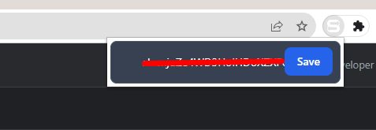
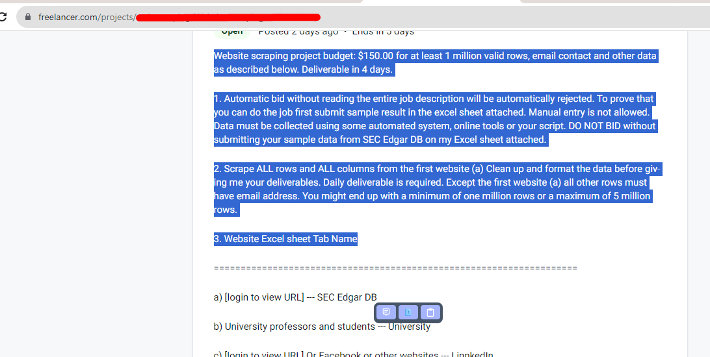

# How to use

## Enter you GPT api key and save

## Select Project description and use the popup buttons
- answer or proposal will be copied to your clipboard after generation.

- Buttons
 1. Generate Proposal.
 2. Generate answer for a question.
 3. Copy generated answer.

Enjoy it.
